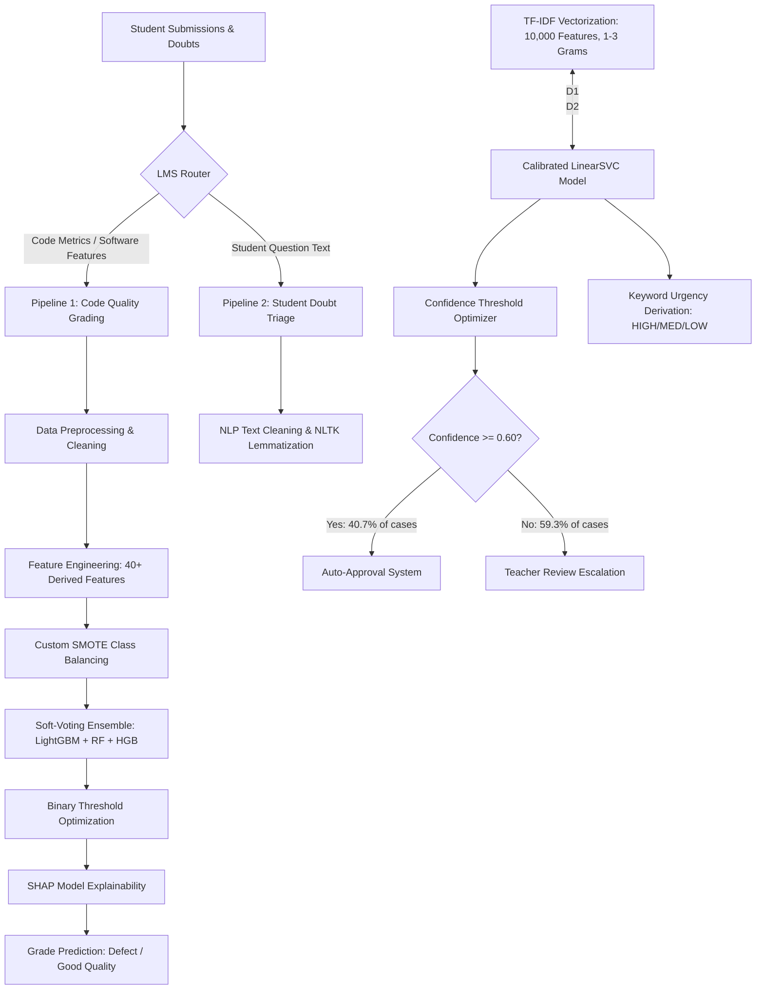

# 🚀 KPMG AI/ML Assessment — Code Grading & Student Doubt Triage Pipelines

This document provides a comprehensive technical overview of the two machine learning pipelines built for the Learning Management System (LMS). It details the architecture, algorithms, feature engineering techniques, evaluation metrics, and API integration strategies used in the project.

---

## 📐 High-Level System Architecture



---

## 🛠️ Pipeline 1: ML-Based Code Quality Grading

### 1. Business Objective
Automate the assessment of student programming submissions by predicting software defect probability from static software engineering metrics. Submissions with high defect probability are flagged for manual instructor review.

### 2. Dataset & Features
- **Dataset:** Software Defect Dataset (derived from NASA KC1 software defect repository, 1,000 module samples).
- **Raw Metrics (10):**
  - `LOC`: Lines of Code
  - `CYCLO`: McCabe Cyclomatic Complexity
  - `LENGTH`: Halstead Length
  - `VOLUME`: Halstead Volume
  - `DIFFICULTY`: Halstead Difficulty
  - `INT_FAN_IN`: Internal Fan In
  - `INT_FAN_OUT`: Internal Fan Out
  - `NUM_OPERATORS`: Total Operators
  - `NUM_OPERANDS`: Total Operands
  - `BRANCH_COUNT`: Branch Count

### 3. Preprocessing & Data Cleaning
- **Duplicate Removal:** Automated checks for duplicate metric rows.
- **Missing Value Handling:** Median imputation for missing numeric values.
- **Outlier Inspection:** Interquartile Range (IQR) and Z-score outlier detection (outliers preserved for tree-based models).
- **Stratified Train/Val/Test Split:** 60% Train (600), 20% Validation (200), 20% Test (200).

### 4. Advanced Feature Engineering (40+ Derived Features)
To extract maximal predictive signal, the pipeline engineers composite features across 5 structural categories:
1. **Ratio Features:**
   - `Complexity_per_LOC` = `CYCLO / LOC`
   - `Branch_Density` = `BRANCH_COUNT / LOC`
   - `Fan_Ratio` = `INT_FAN_IN / INT_FAN_OUT`
   - `Halstead_per_LOC` = `VOLUME / LOC`
2. **Interaction Features:**
   - `LOC_x_DIFFICULTY`, `CYCLO_x_VOLUME`, `OPERATORS_x_OPERANDS`, `VOLUME_x_DIFFICULTY`, `CYCLO_x_BRANCH`
3. **Polynomial Features:**
   - `LOC_squared`, `CYCLO_squared`, `VOLUME_squared`, `BRANCH_squared`, `DIFFICULTY_squared`
4. **Log Transformations:**
   - `LOC_log`, `VOLUME_log`, `CYCLO_log`, `LENGTH_log` (using `np.log1p` to handle skewness)
5. **Statistical Aggregations:**
   - `Complexity_Group_Mean/Std`, `Halstead_Group_Mean/Std`, `All_Features_Mean/Std`
   - `Operator_Ratio` = `NUM_OPERATORS / (NUM_OPERATORS + NUM_OPERANDS)`

### 5. Class Imbalance Strategy
- **Custom SMOTE Oversampling:** Uses `sklearn.neighbors.NearestNeighbors` to generate synthetic minority class (defect) samples, balancing the training set without external package incompatibilities.

### 6. Model Training & Tuning
- **Baseline Model:** Random Forest Classifier (`n_estimators=100`, `class_weight='balanced'`).
- **Hyperparameter Optimization:** Optuna Bayesian search over LightGBM parameter space (`n_estimators`, `max_depth`, `learning_rate`, `num_leaves`, `colsample_bytree`, `subsample`).
- **Soft-Voting Ensemble:** Combines `HistGradientBoostingClassifier`, `RandomForestClassifier`, and `LGBMClassifier`.

### 7. Evaluation & Threshold Optimization
- Sweeps binary classification decision thresholds ($0.25 \dots 0.75$) to optimize F1-score and Recall.
- **Current Performance Highlights:**
  - **Cross-Validation ROC-AUC:** `0.8515` (LightGBM+SMOTE) / `0.8883` (Soft-Voting Ensemble)
  - **Test Recall (Defect Capture):** `84.13%` (at optimal threshold `0.30`)
  - **Test F1-Score:** `44.17%` (at optimal threshold `0.30`)

### 8. Explainability
- Integrates **SHAP (SHapley Additive exPlanations)** with `TreeExplainer` to produce:
  - Global Feature Summary Plots
  - Mean Absolute Impact Bar Charts
  - Individual Prediction Waterfall Diagrams

---

## 💬 Pipeline 2: Student Doubt Triage & Automated Routing

### 1. Business Objective
Automatically categorize student natural-language programming questions into 9 educational topics, assign urgency levels, and route them to either **Auto Approval** (direct response) or **Teacher Review**.

### 2. Dataset
- **Dataset:** CS1QA Educational Programming Q&A Dataset (9,237 annotated student queries).
- **Target Categories (9):** `algorithm`, `code_explain`, `code_understanding`, `error`, `logical`, `reasoning`, `task`, `usage`, `variable`.

### 3. NLP Preprocessing Pipeline
1. Text lowercasing and ASCII normalization.
2. Removal of URLs, HTML tags, punctuation, and digits.
3. Stopword filtering (English & programming noise).
4. **Lemmatization:** WordNet Lemmatizer (`nltk`) reducing words to root forms (e.g., `running` → `run`).

### 4. Feature Extraction
- **TF-IDF Vectorizer:**
  - `max_features = 10,000`
  - `ngram_range = (1, 3)` (unigrams, bigrams, and trigrams)
  - `sublinear_tf = True`

### 5. Model Architecture & Calibration
- **Baseline:** Logistic Regression One-vs-Rest (`max_iter=1000`, `class_weight='balanced'`).
- **Final Model:** `LinearSVC` wrapped in `CalibratedClassifierCV` (Sigmoid calibration) to convert margin distances into well-calibrated probability distributions ($P(c|x)$).

### 6. Decision Threshold Routing & Urgency
- **Confidence Thresholding:** Evaluates confidence scores ($\max P(c|x)$) against thresholds ($0.60 \dots 0.90$).
- **Optimal Cutoff:** `0.60`
  - **Auto-Approved:** Confidence $\ge 0.60$ (**40.7%** of doubts, achieving **88.1%** accuracy).
  - **Teacher Review:** Confidence $< 0.60$ (**59.3%** of doubts escalated to human instructors).
- **Urgency Classification:** Heuristic keyword matching algorithm detecting high-priority signals (`error`, `crash`, `deadline`, `urgent`, `stuck`) to flag doubts as `HIGH`, `MEDIUM`, or `LOW` urgency.

### 7. Current Performance Highlights
- **Test Accuracy:** `63.33%`
- **Macro F1-Score:** `63.02%`
- **Weighted F1-Score:** `63.31%`

---

## 🌐 API & UI Integration

### FastAPI Production Server (`api/app.py` & `api/routes.py`)
- `POST /predict-grade`: Accepts 10 software metrics, dynamically computes derived features, and outputs quality grade, confidence, and SHAP feature values.
- `POST /predict-doubt`: Accepts student question text, applies NLP cleaning & TF-IDF, and returns topic prediction, confidence, urgency, and routing recommendation.
- `GET /health`: System status and model registry check.

### Interactive Gradio Dashboard (`api/gradio_app.py`)
- Web UI mounted at `/gradio` featuring tabbed interfaces for live code grading testing, question classification testing, dynamic project metrics rendering, and system health checks.

---

## 📂 Key File Map

| File | Purpose |
|---|---|
| `notebooks/01_code_grading.py` | Complete Pipeline 1 notebook (EDA, SMOTE, Optuna, Ensemble, SHAP) |
| `notebooks/02_doubt_triage.py` | Complete Pipeline 2 notebook (NLP, TF-IDF, Calibrated SVC, Routing) |
| `src/feature_engineering.py` | Implementation of 40+ derived software metrics |
| `src/model_training.py` | Model trainers, Optuna tuning, custom SMOTE, and ensemble methods |
| `src/text_processing.py` | Text cleaning, lemmatization, and TF-IDF utilities |
| `src/threshold_optimizer.py` | Confidence threshold sweep & routing logic |
| `api/app.py` | FastAPI application entry point |
| `api/routes.py` | Route handlers and model loading registry |
| `api/gradio_app.py` | Interactive Gradio dashboard with dynamic metric rendering |
| `models/doubt_triage_metrics.json` | Real-time persisted model evaluation metrics |

---

## 🚦 Running the Pipelines Locally

### 1. Execute Pipeline 1 (Code Grading)
```bash
python notebooks/01_code_grading.py
```

### 2. Execute Pipeline 2 (Doubt Triage)
```bash
python notebooks/02_doubt_triage.py
```

### 3. Launch Local API Server
```bash
python -m uvicorn api.app:app --reload --port 8000
```
Visit `http://localhost:8000/` for HTML Dashboard, `http://localhost:8000/docs` for Swagger API, and `http://localhost:8000/gradio` for Gradio UI.
